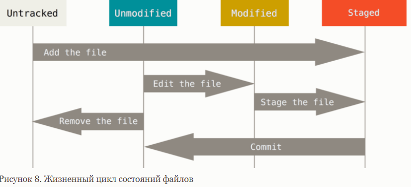

# инструкция по Git

## 1. инициализация репозитория

добавили строку

## 2. Сохранение изменений в файл

чтобы сохранить изменения необходимо ввести команду
git add и кнопкой выбрать нужный файл
удалили все что было в строке 3

## Домашнее задание

* Установка и настройка Git

Для установки Git в Windows также имеется несколько способов. Официальная сборка доступна для скачивания на официальном сайте Git. Просто перейдите на страницу https://git-scm.com/download/win, и загрузка запустится автоматически. Обратите внимание, что это отдельный проект, называемый Git для Windows; для получения дополнительной информации о нём перейдите на https://gitforwindows.org.

Для автоматической установки вы можете использовать пакет Git Chocolatey. Обратите внимание, что пакет Chocolatey поддерживается сообществом.

* Инициализация репозитория

Обычно вы получаете репозиторий Git одним из двух способов:

Вы можете взять локальный каталог, который в настоящее время не находится под версионным контролем, и превратить его в репозиторий Git, либо

Вы можете клонировать существующий репозиторий Git из любого места.

В обоих случаях вы получите готовый к работе Git репозиторий на вашем компьютере.

Создание репозитория в существующем каталоге
Если у вас уже есть проект в каталоге, который не находится под версионным контролем Git, то для начала нужно перейти в него. Если вы не делали этого раньше, то для разных операционных систем это выглядит по-разному:
для Linux:

$ cd /home/user/my_project
для macOS:

$ cd /Users/user/my_project
для Windows:

$ cd C:/Users/user/my_project
а затем выполните команду:

$ git init
Эта команда создаёт в текущем каталоге новый подкаталог с именем .git, содержащий все необходимые файлы репозитория — структуру Git репозитория. На этом этапе ваш проект ещё не находится под версионным контролем. Подробное описание файлов, содержащихся в только что созданном вами каталоге .git, приведено в главе Git изнутри

Если вы хотите добавить под версионный контроль существующие файлы (в отличие от пустого каталога), вам стоит добавить их в индекс и осуществить первый коммит изменений. Добиться этого вы сможете запустив команду git add несколько раз, указав индексируемые файлы, а затем выполнив git commit:

$ git add *.c
$ git add LICENSE
$ git commit -m 'Initial project version'
Мы разберем, что делают эти команды чуть позже. Теперь у вас есть Git-репозиторий с отслеживаемыми файлами и начальным коммитом.
* Запись изменений в репозитории

Итак, у вас имеется настоящий Git-репозиторий и рабочая копия файлов для некоторого проекта. Вам нужно делать некоторые изменения и фиксировать «снимки» состояния (snapshots) этих изменений в вашем репозитории каждый раз, когда проект достигает состояния, которое вам хотелось бы сохранить.

Запомните, каждый файл в вашем рабочем каталоге может находиться в одном из двух состояний: под версионным контролем (отслеживаемые) и нет (неотслеживаемые). Отслеживаемые файлы — это те файлы, которые были в последнем снимке состояния проекта; они могут быть неизменёнными, изменёнными или подготовленными к коммиту. Если кратко, то отслеживаемые файлы — это те файлы, о которых знает Git.

Неотслеживаемые файлы — это всё остальное, любые файлы в вашем рабочем каталоге, которые не входили в ваш последний снимок состояния и не подготовлены к коммиту. Когда вы впервые клонируете репозиторий, все файлы будут отслеживаемыми и неизменёнными, потому что Git только что их извлек и вы ничего пока не редактировали.

Как только вы отредактируете файлы, Git будет рассматривать их как изменённые, так как вы изменили их с момента последнего коммита. Вы индексируете эти изменения, затем фиксируете все проиндексированные изменения, а затем цикл повторяется.

* Получение информации по истории коммита (git log)

После того, как вы создали несколько коммитов или же клонировали репозиторий с уже существующей историей коммитов, вероятно вам понадобится возможность посмотреть что было сделано — историю коммитов. Одним из основных и наиболее мощных инструментов для этого является команда git log.

* Сравнение с последним коммитом

Одним из самых полезных аргументов является -p или --patch, который показывает разницу (выводит патч), внесённую в каждый коммит. Так же вы можете ограничить количество записей в выводе команды; используйте параметр -2 для вывода только двух записей

Эта опция отображает аналогичную информацию но содержит разницу для каждой записи. Очень удобно использовать данную опцию для код ревью или для быстрого просмотра серии внесённых изменений. Так же есть возможность использовать серию опций для обобщения. Например, если вы хотите увидеть сокращённую статистику для каждого коммита, вы можете использовать опцию --stat

* Перемещение между сохранениями

Команда git checkout позволяет выполнить переключение между версиями. Для работы нужно указать не только интересующий коммит, но и вернуться в тот, где работаем, при помощи команды git checkout master.